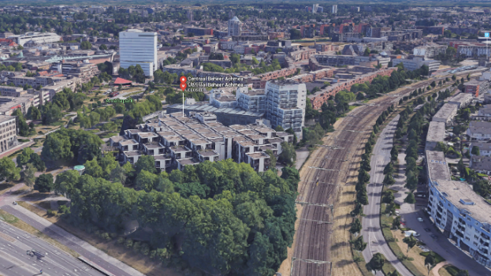

# Centraal Beheer Offices (1968-1972)
### Apeldoorn, Netherlands
#### Herman Hertzberger
Prins Willem-Alexanderlaan 651, 73111 NB Apeldoorn
(1)

### What is it for?
This is an office building designed to accommodate over 1000 employees. Structurally, it had the goal of accessibility in mind. Employees were kept close together so they would have easy access to eachother. Walkways were easy to navigate so employees could easily get to the nearby coffee shops or train station. Walls and private spaces were reduced in favor of an open layout, promoting the accessibility of each employee to the group atmosphere. This is meant to relax the employees, resembling a settlement or communal street. Relaxed and happy employees are important for the management, who want to retain some hard to find personell relocating from Amsterdam. The design was also very open and transparent. The idea was to educate those walking through about the structural makeup and functions of the building around them.
(1 & 2)

### Technical Drawings

(1)

### Exterior Photos

#### Brick, Concrete, and Glass boxes at various heights with lots of vegetation

Notice the cars parked under the building in the bottom. This building had a more open floorplan that allowed a connection with the outside, but this would change in later buildings as terrorism in The Netherlands became more of a concern.
(3)

#### Full view of the repeated box pattern of the building

These connected boxes form natural pathways in a grid-like manner, only tilted at an axis from the parking lot and train station.
(3)

### Printed Sources
#### Polyvalence: The Competence of Form and Space with Regard to Different Interpretations
This article describes the concept of polyvalence in architecture, and how it pertains to the Centraal Beheer Offices. Essentially, one can design a building to be perfectly tailored to the needs of the client, but this can result in overfitting and a lack of flexibility. On the other side of the spectrum, a space can be so devoid of tailoring that it borders on useless and bland for most purposes. The concept of polyvalence is to remain general enough to account for unexpected constraints and flexibility, while considering multiple of the primary uses of a space. The boxes in this building are polyvalent spaces, being used for offices, bathrooms, coffee shops, and more.
(5)

#### Revisiting Herman Hertzberger and the Dutch Structuralists
This article talks about the socialist ideology that is present in Dutch structuralism. The order and structure of these buildings were mean to encourage social order an social interaction. When the building was completed, Hertzberger directed the photographers to take photos of the employees socializing, playing games, and relaxing. He was very focused on portraying the social value of his architecture style, and thus his buildings had a note of the "us building a city" feeling that built up after the world wars.
(6)

### Artists Rendition of the Centraal Beheer Offices
TODO - DRAW

### Interior
#### Desk in the open plan office layout

You can see the social accessibility that Hertzberger was trying to achieve. A lack of walls means that from the desk you are easily among everyone else.
(1)

### Surroundings
#### Isometric view of the office in Google Earth

The surrounding region shaped how the building was developed. The proximity to other upper class residential and office buildings allowed this building to get the funding it needed for a unique design. The proximity to the train station contributed to the accessibility of the building, as it was easy to get to and move within.

### Interview with Herman Hertzberger
In a brief interview regarding his thoughts about the building, Hertzberger recounts his thoughts towards the employees. He didn't want them to just be a number, or be afraid to speak up about their working conditions. He wanted them to be able to personalize their desks in the way they like. In a sense, he wanted to capture the enormous vitality and inventiveness of organisational life.
(4)

### Short Documentary

One thing you might notice in this video is that Hertzberger created a makeup station so that women could put on makeup and gossip in private. This shows how focused he really was on making the employees comfortable, happy, and social.
(2)

### Related Blog
There exists a related blog by Luis Arruti that discusses many aspects about this building. I find it interesting that he points out that Herman Hertzberger recieved one of the most prestigious awards in architecture, the Royal Gold Medal. He theorizes that this was due to his focus on the individual, rather than "function follows form" and I am inclined to agree with him.
(3)

## Sources Cited
1. Hertzberger, Herman. “Centraal Beheer Offices, Apeldoorn.” AHH, Architecturrstudio HH, www.ahh.nl/index.php/en/projects2/12-utiliteitsbouw/85-centraal-beheer-offices-apeldoorn

2. Hertzberger, Herman, director. Centraal Beheer Apeldoorn in Van Gewest Tot Gewest. Youtube, 1978.

3. Arruit, Luis. Centraal Beheer Offices Blog, Luis Arruit, 2015, centraalbeheeroffices.blogspot.com/.

4. Duffy, Francis. “Hertzberger on the Slow Track.” Architects Journal, 16 Feb. 2012.

5. "Polyvalence: The Competence of Form and Space with Regard to Different Interpretations." Architectural Design, September 5, 2014. Wiley.

6. Rakesh, Ramchurn. "Revisiting Herman Hertzberger and the Dutch Structuralists." The Architects' Journal, November 13, 2014. ProQuest.
